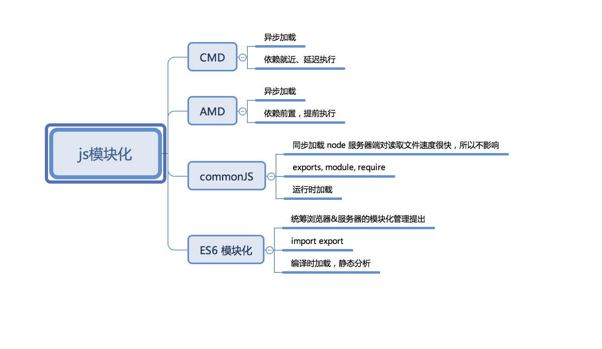

## js模块化

### js为什么没有模块化？

js语言设计的初期只是单纯页面交互，但是随着Ajax的产生和广泛应用，使得表单校验，路由切换等等放到前端实现，代码越来越庞大。

### 为什么会出现模块化？

前端代码越来越庞大，使得难以维护，许多问题暴露出来，如：命名冲突，依赖需要手动维护等等，所以借鉴其他语言：如：C，java来实现模块化的概念。

### 模块化的两种实现方案
#### 解决方案1: 包裹对象
```
var a = {
    name:'xx',
    age:18,
    change:function(){
        
    }
}
```

优点：可以解决命名冲突，但是外部，a对象中的变量暴露给外部，外部可以随意修改内部的属性

#### 解决方案2：函数有作用域（自执行函数）

函数有作用域的概念存在，所以可以实现暴露出函数出来外部不修改内部的数据，外部不能修改内部数据，但是外部可以重写内部数据

```
var a =(function(){
    var name = 'xx';
    var age = 18;
    function change(){
        
    }
    return {
        change:change
    }
})()
```
## 目前js模块化的解决方案

### CommonJS
node.js是CommonJS的践行者，使用**require, module, exports**来管理模块的输入和输出；
> 特点：同步，运行时加载

> 底层：import的是对象，模块的实现也就是基于函数的一个封装；
### ES6 Module
ES6 Module想统一浏览器和服务器对模块的实现，使用**export, import**关键字支持对模块的输入和输出
> 特点

静态加载，编译时就能确定模块的依赖关系

> 使用
import是对模块的引入，export是对模型的输出，输出的是变量和接口名的一一对应关系
```js
// 报错
export 1;

// 报错
var m = 1;
export m;

// 写法一 正确
export var m = 1;

// 写法二 正确
var m = 1;
export {m};

// 写法三 正确
var n = 1;
export {n as m};
```
### 其他模块化编程；


### 微信小程序的模块化
- 微信小程序采用CommonJS的语法，但是小程序是运行在微信浏览器里面；
- 运行时，微信小程序会将转成前端模块依赖规范，代码和CMD规范类似；
- 在引用第三方包时，需求强制指定module.exports;
- ？微信小程序为什么需要用CommonJS 规范，运行时转为CMD？


### 运行时和编译时

### CommonJS和ES6 module的比较
- 1、CommonJS模块输出是值的拷贝，ES6模块输出是值的引用；
- 2、CommonJS是运行时加载模块，生成整个对象，然后读取对应方法；ES6是编译时加载，是静态分析，可以直接import某个方法；
- 3、CommonJS是同步加载的，ES6 模块是异步加载，有一个独立的模块解析过程。


### 参考：
- [前端模块化](https://juejin.im/post/5aaa37c8f265da23945f365c)

- [ES 6模块化](https://es6.ruanyifeng.com/#docs/module)
