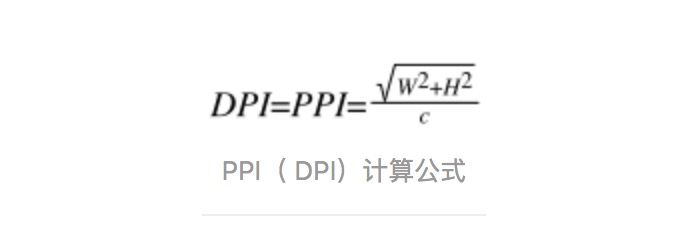

## 安卓的UI单位dp
### dp和px换算
换算规律，当dpi为160时，1px = 1dp
```js
px = dp * (dpi / 160)。
```
### dpi（像素密度）
屏幕的分辨率(物理像素)宽的平方和分辨率高的平方/屏幕尺寸


### dpr(设备像素比)
不同设备屏幕的dpr不一样，比如苹果高清屏dpr就是2。所以设计会给出2倍图，3倍图等来适配不同dpr;
```js
// 可以获取到设备dpr
window.devicePixelRatio
```
### css像素
css像素是抽象的，可缩小放大，

## todo
- web的一个适配方案，flexable, rem
- 安卓的适配方案；

## 参考
[H5移动多终端适配全解 - 从原理到方案
](https://zhuanlan.zhihu.com/p/25422063)